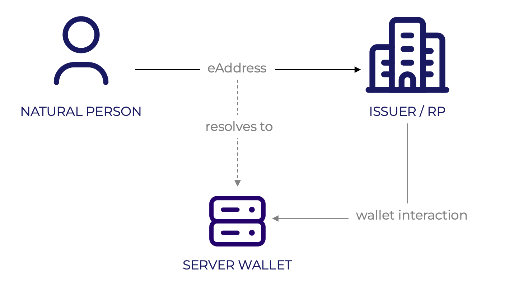
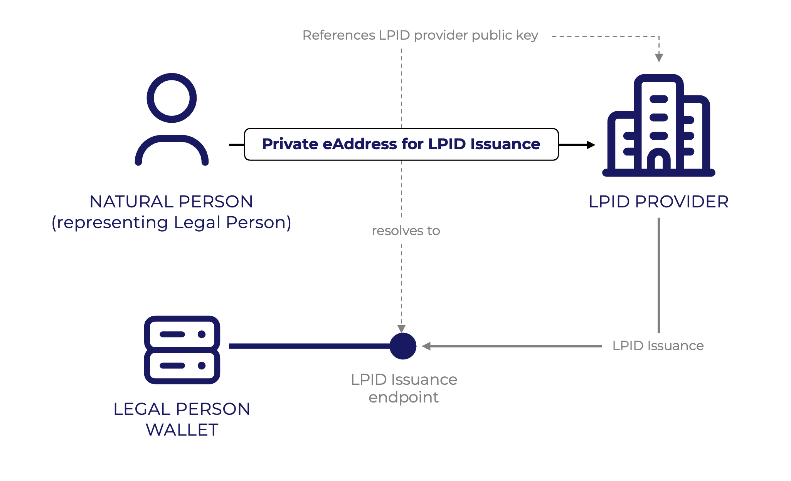
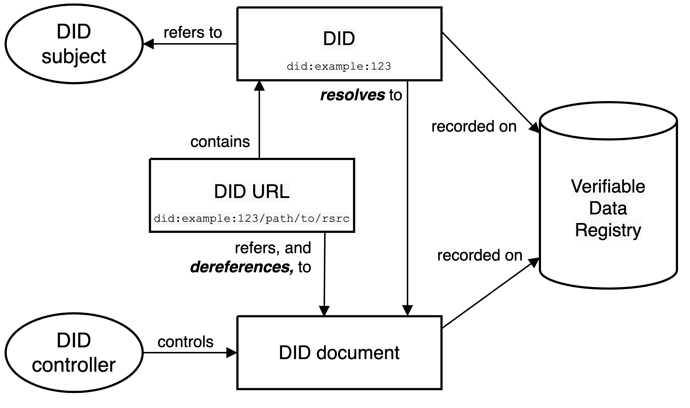
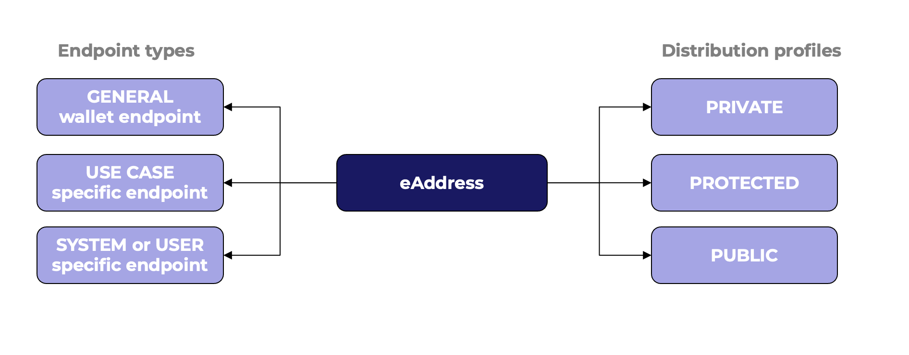

# Wallet eAddress

## Need for wallet eAddress

To initiate a wallet interaction, the current EUDI Wallet designs assume the wallet is equipped with a camera for scanning a QR code presented by an issuer or a relying party. Alternatively, the wallet user can invoke their wallet by clicking a deep link that the issuer or relying party presents. This method enables the user to initiate the credential exchange by “pulling” the issuer or relying party to interact with the wallet without exposing a public endpoint.

Server-based wallets in general have no camera or support for deep links, so an alternative approach is needed to enable secure initiation between a server-based wallet and an issuer or relying party. The solution would require that the issuer or relying party is provided with information that enables them to initiate the wallet interaction by “pushing” a request to a server-based wallet.

This document proposes that server-based wallets should have a resolvable address (eAddress), which can be shared by authorized natural persons, and which can be used by the issuer or relying party to resolve an endpoint to which credential proposals and presentation requests can be sent.

Server-based wallets are seen useful, in particular for organization (legal person) wallets that need to be used by multiple persons (or IT systems) in the organization.

Without a harmonized eAddress, server-based wallet endpoints are challenging to discover. Additionally, eAddress provides organizations with tools for better management and monitoring of wallet endpoint usage. This is because a large organization may have multiple users (up to hundreds) utilizing the wallet capabilities simultaneously, depending on the type of business. The use of eAddresses harmonize how server-based wallet endpoints are exposed; to which users or use cases they belong to; and ease endpoint versioning and access control.

## Benefits of eAddress

Use of eAddress provides many benefits for use with server-based wallets. Especially it aids organizations to better integrate wallets with their Identity and Access Management architecture.

Some identified benefits of eAddresses with server-based wallets are:
- Flexible presentation and discovery of server-based wallet endpoints.
- Additional security measures that can be fine-grained according to organization’s architecture and use case needs.
- Helps integrate wallet interactions with specific business use cases and systems.
- Easier management of wallet endpoint use, including endpoint access control, API version upgrades, rotation of keys and endpoint access revocation.

## eAddress use cases

### 1. LPID issuance

In the LPID issuance process, after authenticating the legal person representative and validating their authorization to represent the legal person, the PID Provider asks the natural person for a wallet id or endpoint for the wallet of the legal person and the natural person submits them. The PID Provider then issues the LPID to the wallet instance.

In this use case, the natural person representing the legal person can provide the eAddress that points to the LPID issuance endpoint of the Legal Person Wallet.

### 2. Server-based wallet discovery in attestation presentation

In a typical interaction with a relying party, the relying party needs to discover the wallet which can present the necessary attestations to the relying party. 
In normal EUDI Wallet flow, this is done by the Wallet user by initating the interaction using QR-codes, or other mechanisms. As server-based wallets do not necessarily have a mobile interface that can be used to intiate the interaction, there is a need to enable wallet discovery, also known as an introduction flow, which introduces the relying party to the server-based wallet.

This can be done by providing the wallet’s eAddress to the relying party, which uses the address to send a subsequent presentation request to the server-based wallet.

In EWC, this applies at least to Task 3.3., which include the following use cases:
- Opening a business account in a bank (KYC)
- Public procurement
- Create branch

### 3. Authorized attestation issuance to a server wallet
In EWC Task 3.3 pilot on vReceipt, a traveler has bought a travel ticket and wants the merchant to send a verifiable eReceipt (vReceipt) directly to their employer for accounting. 
The traveler presents the eAddress of their employer’s wallet, authorizing the merchant start the issuance flow of the vReceipt using the endpoint and provided authorization information.

## Solution outline
The eAddress solution is comprised of the following:
- **eAddress:** Unique and resolvable identifier that can be used and shared by a user
- **eAddress description document:** Document containing endpoint and authorization information, and cryptographically bound to the identifier (aka )
- **eAddress registry:** Registry containing the document (also known as Verifiable Data Registry)
- **Resolver**, which supports the eAddress resolution methods and is able to resolve the eAddress document using the eAddress 

### eAddress solution overview

The eAddress is implemented as a Decentralized Identifier, based on W3C Decentralized Identifiers (DIDs) v1.0 recommendation. Conforming to the W3C DID specification and the architecture.

Use of the eAddress requires that the organization wallet has access to a Verifiable Data Registry (VDR), used to resolve the eAddress to a wallet endpoint. VDR’s are DID-method specific, and this specification defines which DID-methods and thus VDR’s are supported.

The DID subject of the eAddress can be the entity that controls the server-based wallet, or any other system subject it. Examples of a system are an automated business process, or an expense management system. The DID controller is the wallet administrator, or an authorized user with privileges to control the DID Document.

In addition to the W3C DID recommendation, eAddress requires that it MUST have at least one service endpoint defined in the DID Document.

### eAddress registration and control
The eAddress is controlled by the wallet owner using its server-based wallet.
The server-based wallet administrator or user (depending on the owner's policies) can create new eAddresses for their use cases, selecting appropriate endpoint types and distribution profiles.

### DID methods
Once the eAddress has been provided to the RP / issuer, it must be resolved to a DID Document, which contains the wallet endpoint address and any access information.

According to the DID Core specification, the DID methods define how the DID is resolved to the DID Document and also how the DID and accompanying DID Document is created, updated and deactivated.

The controller of the server-based wallet must choose a DID method they use to resolve the eAddress DID to the DID Document. The chosen DID method must support service endpoints and allow use of additional properties in the service endpoint objects to support eAddress.

The future RFC defines the supported DID methods.

### eAddress presentation

The eAddress can be presented using any mechanism either in-band using EUDI Wallets, or out-of-band using other methods.

For example, the eAddress can be presented in the following ways:
- as an attestation from the natural person wallet
- using proximity presentation (QR-code / NFC) read by the RP/issuer (e.g. cash registry)
- By writing or copying the address to a web form
- presenting it using a smart card or a virtual card
- providing it via API
- presenting a QR-code via physical medium (e.g. sticker)

### Endpoint types

The eAddress can technically refer to any type of endpoint. However, for security, control, and enterprise system integration purposes, it is useful to define the types of endpoints the eAddress can point to. The endpoint type can be used to define additional control checks by the wallet prior to proceeding with the interaction.

For example, the eAddress can point to one of the following types of endpoints:
- **General wallet interaction endpoint.** Allows generally supported EUDI wallet interactions, such as credential presentation request or credential proposal.
- **Use case specific endpoint.** Endpoint accepts only specific wallet interactions or attestation types. E.g. endpoint to receive only eReceipt EAA’s, or LPID issuance. Others are denied.
- **System or user verifiable endpoint.** Requests made to the endpoint require system or user verification. For example, when a request is sent to the endpoint, wallet (through integration with backend systems) notifies a specific user or system of the request. The user or automated system would need to approve the request before proceeding.

### eAddress distribution profiles

The eAddress may be distributed using alternative profiles, depending on how it needs to be used, and what level of authentications or authorizations are required by the organization or use case.

Distribution profiles provide a mechanism for the wallet's chosen API access control system to authorize the incoming request. Definition or implementation of the API access control system is out of scope for this document, as it varies between wallet implementations.

Three types of distribution profiles are identified:
- **Public.** API Access Control does not verify authentication or authorization the RP / Issuer. For this, it is mandatory that the wallet performs required authorization and identification checks using attestation requests, or other means.
- **Private.** The eAddress is bound to the receiving entity. eAddress DID Document includes RP / Issuer public key used by the API Access Control for authentication before allowing additional requests
- **Protected.** Additional authorization token is provided to the presenter (e.g. natural person). The token can for example be a cryptographic token (e.g. OAuth access token) or human-readable (e.g. PIN-code). API Access Control authorizes the token of the RP / Issuer before allowing additional requests.

## Conformance criteria for wallets

A wallet conforms to the eAddress specification if it:
- supports creation of eAddresses with at least one of the supported did methods
- supports describing at least one wallet endpoint using an eAddress
- supports distributing eAddresses using at least one distribution profile
- supports initiation of a wallet interaction using at least one of the endpoint types

## Security considerations

### Endpoint types
In scenarios wehere the wallet sends the enpoit request content to an integrated application, the wallet should ensure sanitation of the request content to mitigate any injection attacks.

### Distribution profiles
The public distribution profile enables exposure of a public endpoint. This opens the endpoint to potential spam or other malignant uses. Although use of public endpoint may be useful for certain use cases, the security implications should be carefully considered, and it must always be coupled with additional security or verification measures. For example, the endpoint could be configured to always require that the request includes a Wallet Relying Party Access Certificate, before allowing further interactions.

### Other security-related considerations
Wallets should consider providing integration methods to enterprise IAM systems to enable authorized natural persons to verify incoming requests. This is useful for example when a natural person initiates an incoming connection and needs to authorize it.
